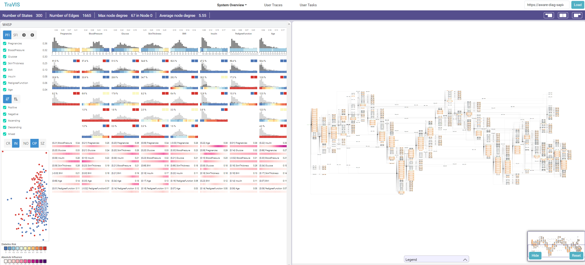

# TraVIS: a User Trace Analyzer to Support the User-Centered Design of Visual Analytics Solutions

## Installation

### Steps to run the server for the first time:

1) Install the requirements running "pip install -r requirements.txt" (If you don't have pip installed, install it)

2) Create a virtual environment by running the command "python -m venv <name_of_the_virtual_environment>" in the terminal

3) Run the runApp file contained in the main directory to start the app: python runApp.py <name_of_the_virtual_environment>

4) In order to run all the functionalities of the framework, download and install GraphViz: https://graphviz.org/download/source/

TraVIS: installation of the dependencies for the traces replay and state chart generation features

1) Install selenium 4.1.3 ----> pip install selenium==4.1.3 (it should be already installed from step 1)

2) Download and put in any folder you like an updated chromedriver https://googlechromelabs.github.io/chrome-for-testing/#stable (Find the list here and download the version relative to your OS). Don't forget to update Chrome.

3) Add the chromedriver's path to PATH environmental variable

4) Change line 1143 in PathSimulator.py to your path to chromedriver. Use double '\' for the path if you get a syntax error.

5) Install the next node modules:

- NodeJS (from v12.20.2)
- Puppeteer node module v13.7.0 (npm install puppeteer@13.7.0)
- fs node module v1.0.0 (npm install fs@v1.0.0)
- is-same-origin node module v0.0.7 (npm install is-same-origin@v0.0.7)

## TraVIS: main functionalities and how to run them

1) In the static/files/URLs folder there's the sampleUrls file. Copy a URL from the file and put it in the "Load System" placeholder: the visualization system will be loaded on the left, the resulting state chart will be loaded on the right. The URLs contain precomputed state charts. If for a visualization system a state chart wasn't generated, the system will invoke a subprocess that in the end generates it and puts it in the DB (it is the state chart generation subprocess). This subprocess can take much time, even an entire day, keep that in mind while trying to generate a new state chart

2) In the User Traces Tab you can see all user traces captured, with many details such as violations in latency thresholds, interactions, etc. They are relative to the Falcon crossfilter Visualization system (see https://vega.github.io/falcon/flights/). This page also allows filtering of the traces based on quantitative details (# of a certain interaction, execution time of the user traces, etc.) and qualitative details (based on the users' personal info, like gender, age, etc.)

3) By selecting a single (or multiple) traces, an extra info div appears on the right. On the top right corner, there's a button for seeing the user trace (or traces) in the interaction space (state chart), whose edges' label are colured accordingly to a color scale, indicating how much a certain interaction has been performed or not. 

4) On the top right corner of the extra info for the trace, it is possible to see a button, used to invoke the replay functionality (available only for a single trace). A new window will be opened, and the trace will be replayed, doing the same interactions in the trace, seeing on the left the visualization system and on the right the state chart, that is coloured basing on the interaction that is being performed in the visualization system. It is possible to play, pause, stop, and reproduce directly the next event by playing the relative buttons on the top.

5) In the User Tasks tab, it is possible to see details about exploratory tasks performed while recording the user traces relative to Falcon crossfilter. It is possible to see details in the inner tables relative to each trace. A correctness percentage of the task is displayed for each trace (and "grouped" for each task). This percentage was calculated to see the users performance on each task, basing on pm4py trace alignment functionalites with an ideal trace (referred to as "golden trace"), that represents a possibly perfect execution of that task on the visualization system. It is also possible to see each task on the interaction space, by having the  state chart coloured as described in section 3.

